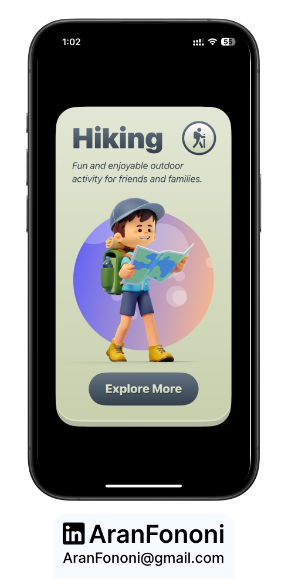

# Hike App 🚀🏔️  

### Exploring SwiftUI with Animations, Layouts & Customization  

This is another exciting project from my **SwiftUI Masterclass** course. I didn’t just follow the lessons—I went deeper, refining animations, enhancing layouts, and implementing **alternate app icons** to make it feel more dynamic and user-friendly.  

## 📌 Project Overview  
The **Hike App** is a visually appealing SwiftUI app that introduces custom app icons, dynamic animations, and flexible layouts while keeping performance smooth.  

⚠️ **Important:** If you plan to modify and experiment, make sure you understand how **app icon customization** works in iOS settings.  

## 🚀 What I Focused On  
- **SwiftUI Layouts:** Mastered `HStack`, `VStack`, and `ZStack` for structured design.  
- **Custom App Icons:** Enabled users to switch between multiple app icons seamlessly.  
- **SF Symbols & Rendering Modes:** Explored different ways to style and display system icons.  
- **Gradient & Motion Animation:** Created dynamic effects using `LinearGradient` and scaling techniques.  

## 🔥 Features  
✅ **Alternate App Icons** – Users can select from multiple custom icons  
✅ **Smooth Animations** – Gradient effects and motion-based transformations  
✅ **Advanced SF Symbols** – Using single color, hierarchical, palette, and multicolor render modes  
✅ **Scalable UI** – Works across iPhone & iPad  

---

## 📸 Screenshot  
  

---

## 🛠️ How to Use  
1. Clone this repository.  
2. Open the project in Xcode (iOS 16+ recommended).  
3. Run on a simulator or device and explore the animations & customization.  

---

## 📬 Contact  
For any questions or collaborations, feel free to reach out:  
- **Email**: [aranfononi@gmail.com](mailto:aranfononi@gmail.com)  
